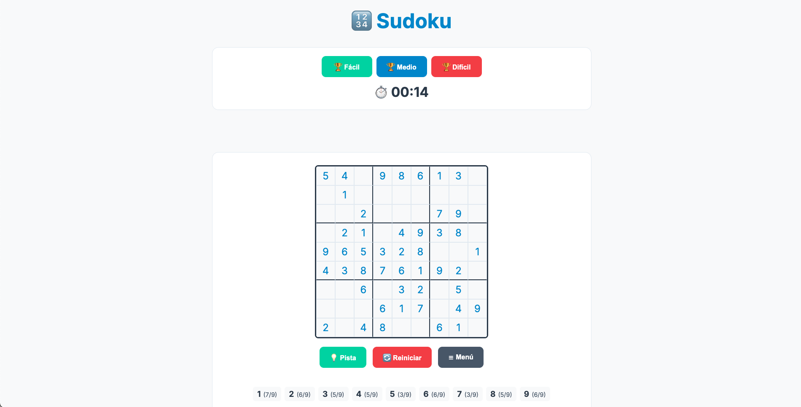

# 🎯 Sudoku JS

¡Bienvenido a mi proyecto de Sudoku! Este es un juego de Sudoku interactivo y completo construido desde cero con HTML, CSS y JavaScript (ES6+), sin librerías externas.

El proyecto incluye un generador de puzles 100% aleatorio, un solucionador por _backtracking_, guardado de partidas, estadísticas y una interfaz limpia y responsiva.

### [➡️ ¡Juega ahora mismo! ⬅️](https://albahdezs.github.io/sudoku/)

## 📸 Captura de Pantalla



---

## ✨ Características Principales (Features)

Este no es solo un tablero de Sudoku, ¡es una aplicación web completa!

- **Generador de Puzles 100% Aleatorio:** Usa un algoritmo de _backtracking_ aleatorio (`solveRandomly`) para crear un puzle único cada vez.
- **3 Niveles de Dificultad:** (Fácil, Medio, Difícil) que borran más o menos celdas.
- **Solucionador Automático:** Resuelve cualquier puzle (o el actual) al instante.
- **Sistema de Pistas Inteligente:** Te da una pista _aleatoria_ con la **solución correcta** para esa celda.
- **Guardado de Partidas:** Guarda tu progreso en `localStorage` para continuar más tarde.
- **Auto-Guardado:** Guarda tu partida automáticamente cada 30 segundos.
- **Estadísticas Completas:** Un modal muestra partidas jugadas, completadas, mejor tiempo y tiempo promedio por dificultad.
- **Mejores Tiempos:** Guarda tu Top 10 de tiempos por dificultad.
- **Contador de Números:** Una barra de accesibilidad te muestra cuántos "1", "2", "3", etc., te faltan por poner.
- **Interfaz de Usuario Moderna:**
  - Diseño limpio (Tema "Menta y Carbón").
  - Resaltado de fila, columna y celda seleccionada.
  - Detección de conflictos (números duplicados) en tiempo real.
  - Menú desplegable y modales (pop-ups) para una UI limpia.
- **100% Responsivo:** Se ve y se juega genial tanto en escritorio como en móvil.

---

## 💻 Tecnologías Utilizadas

- **HTML5:** Para la estructura semántica de la aplicación.
- **CSS3:** Para todo el diseño y la responsividad (usando variables CSS para el tema y Flexbox/Grid).
- **JavaScript (ES6+):** Para toda la lógica del juego. El proyecto está dividido en 4 clases principales para una mejor organización (POO):
  - `SudokuSolver`: Lógica de generación, solución y validación.
  - `SudokuUI`: Manejo de todo el DOM (renderizado, modales, clics).
  - `SudokuStorage`: Manejo de `localStorage` para estadísticas y partidas.
  - `SudokuController`: El "cerebro" que une las otras tres clases y maneja los eventos.

---

## 🚀 Cómo Empezar (Localmente)

Si quieres ejecutar este proyecto en tu propia máquina:

1.  Clona el repositorio:

    ```bash
    git clone [https://github.com/TU_USUARIO/TU_REPO.git](https://github.com/TU_USUARIO/TU_REPO.git)
    ```

    _(¡EDITA ESTO! Reemplaza la URL por la de tu repositorio)_

2.  Navega a la carpeta del proyecto:

    ```bash
    cd TU_REPO
    ```

3.  ¡Y listo! Simplemente abre el archivo `index.html` en tu navegador.
    _(Recomendado: Usa una extensión como "Live Server" en VS Code para verlo en un servidor local)._

---
